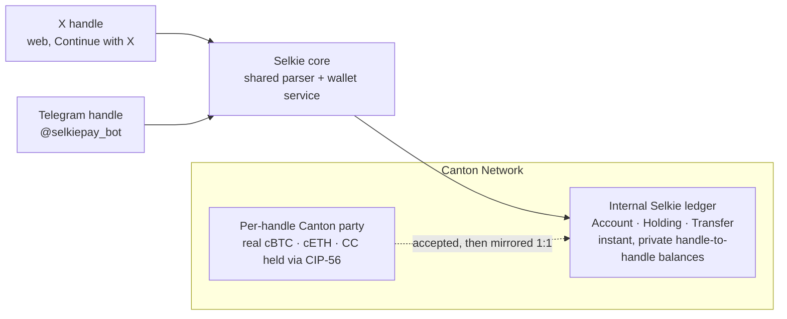

<p align="center">
  
</p>

<h3 align="center">Any handle is a private wallet.</h3>

<p align="center">
  Sign in with X, or open Telegram, and <code>@yourhandle</code> becomes a real wallet on the
  <a href="https://www.canton.network/">Canton Network</a>.<br>
  Send money to a handle in seconds. No app to install, no seed phrase, no gas, no public balance.
</p>

<p align="center">
  
  
  
  
  
</p>

---

## The idea

Crypto keeps losing ordinary people at the same wall: install a wallet, write down twelve words,
buy gas, then paste a forty-character address you cannot read. Social wallets remove that friction,
but on transparent chains they leak everything. Every tip, every balance, every payment becomes
public feed data.

Selkie fixes both. Your **social handle is the address**, so there is nothing to install or back up.
And it is built on **Canton, where privacy is native**: a payment is shared only with the two people
in it, enforced by the ledger rather than promised in a policy. The person you pay does not even need
an account first. If they have never heard of Selkie, the payment itself creates their wallet, and the
money is already theirs.

> `send 5 CC to @ada` is the whole thing. If `@ada` is new, her wallet appears mid-payment.

Built for **HackCanton Season 2** (July 2026). Track: Financial Applications. Challenges: cBTC and cETH.

## Try it

- **Telegram**: [**@selkiepay_bot**](https://t.me/selkiepay_bot) is live on Canton DevNet. Tap
  `/start` and your Telegram username is your wallet.
- **Web wallet**: run it locally in a minute (see [Run it](#run-it)). A hosted demo link lands here
  for the submission.

## What works today

Everything below settles on real Canton contracts. There are no mocks.

| You say | What happens |
|---|---|
| `send 5 CC to @ada` | Instant, private transfer. If `@ada` is new, the payment creates her wallet. |
| `send 2 cBTC to <address>` | Pay a Canton address directly. The receipt shows the handle behind it. |
| `request 10 CC from @ada` | An ask, not a charge. Nothing moves until she approves. |
| `approve @ada` / `decline @ada` | Answer a request. Approving is the single atomic step that pays. |
| `requests` | Who is waiting on you, and who you are waiting on. |
| `balance` | Your private balance, read live from the ledger. |
| `history` | Your recent activity, grouped by day. |
| `receive` | Your handle and the Canton address behind it, to fund from any Canton wallet. |

Two surfaces, one wallet grammar:

- **Web** (`web-vite/`): a React app. Continue with X, then a dashboard for balances, send, requests,
  activity, and a shareable page for any handle so it can be paid before it even has a wallet.
- **Telegram** (`bot/`): the same commands as a chat bot, with a persistent button bar, a full
  slash-command menu, and inline Pay / Decline buttons on requests.

Your X wallet and your Telegram wallet are separate accounts, each keyed to that platform's handle.

## Assets

| Code | Asset | Notes |
|---|---|---|
| `CC` | Canton Coin | The network's native asset. |
| `USDCx` | USDCx | A digital dollar on Canton. |
| `cBTC` | Bitcoin on Canton | Real token-standard holdings on DevNet, at your own party. |
| `cETH` | Ether on Canton | Real token-standard holdings on DevNet, at your own party. |

cBTC and cETH are not IOUs in a spreadsheet. They are live CIP-56 holdings on Canton DevNet, held at
each handle's own party and provable on-ledger. `GET /api/reserve` prints the reserve to anyone, no
login required.

## Why Canton

Selkie needs three things a payments app cannot fake, and Canton is the network that offers all three
at once.

- **Privacy is native.** Transactions are shared only with their parties. A consumer wallet has to
  keep balances private, and on Canton that is the default, not a bolt-on.
- **Real, interoperable assets.** Canton Coin is native, and Bitcoin and Ether arrive as cBTC and
  cETH through one shared token standard. Selkie speaks that standard, so every asset moves through
  the same path.
- **Settlement without gas games.** Payments settle deterministically. There is no public mempool to
  front-run and no gas auction to lose money in. That is what lets a handle-to-handle payment feel
  instant.

## How it works

Every handle owns its own Canton party: the real address behind the name. Selkie runs two layers on
top of that, and both are real.



1. **Real holdings at a per-handle party.** Send cBTC, cETH or Canton Coin to the address behind a
   handle and Selkie accepts the incoming token-standard transfer for you, so you never touch a
   pending-transfer screen. The real token ends up owned by your own party.
2. **Instant balances on the internal ledger.** Handle-to-handle sends move `Holding` contracts as a
   debit plus credit, composed atomically in a single Canton transaction, which is why a payment lands
   in seconds and stays private between the two of you.
3. **One token standard for all of it.** Canton Coin, cBTC and cETH implement the same CIP-56
   interfaces (`bot/src/token.mjs`), so accepting a deposit is the same dance for every asset. The
   only differences are the instrument id and where the accept's choice context comes from.

The ledger model lives in `daml/`. Operator authority is constrained to explicit contract choices:
there is no choice that moves funds without the owner's instruction, so custody abuse is structurally
impossible on-ledger.

## Proof it is real

- **On-ledger settlement.** Every transfer executes on the JSON Ledger API v2 and every settlement
  has an on-ledger `updateId`.
- **Open reserve.** `GET /api/reserve` proves the cBTC and cETH holdings with no login.
- **Balances are never cached.** Every balance reads straight from the ledger.
- **Tests against a live ledger.** The suite covers the parser, wallet, pool, deposits, sweeper,
  sessions, and both surfaces, including integration tests that run against a real participant.

## Repo layout

```
daml/       Ledger model: Account · Holding · Transfer · Request · Escrow · Rewards
bot/        Shared parser + wallet service, and the Telegram bot
server/     Web server: X login, wallet API, deposit sweeper, static hosting
web-vite/   The web app (React + Vite): dashboard, send, requests, docs
docs/       DevNet setup (docs/devnet.md) and submission notes
branding/   Marks and banners
```

## Run it

Prerequisites: Node 20+, and access to a Canton participant (a local Splice LocalNet stack, or DevNet
credentials). Ledger setup and the full list of environment variables are in
[`docs/devnet.md`](docs/devnet.md). Secrets live only in gitignored `.env` files.

```bash
# 1. Build the ledger model and pin its package id
cd daml && daml build
export SELKIE_PKG_ID=$(daml damlc inspect-dar --json .daml/dist/selkie-0.1.0.dar | jq -r .main_package_id)

# 2. Run the tests (unit + live-ledger integration)
cd ../bot && npm install && npm test
cd ../server && npm install && npm test

# 3. Build the web app
cd ../web-vite && npm install && npm run build

# 4. Web wallet + API (X login, dashboard, /api/reserve) -> http://localhost:4000
cd ../server && source .env && node src/index.mjs

# 5. The Telegram bot (t.me/selkiepay_bot)
cd ../bot && source .env && node src/index.mjs
```

## Roadmap

The wallet is real today. Here is what comes next.

| | Status |
|---|---|
| **On and off ramp** so funding and cashing out are as easy as the rest of the app | Planned |
| **Send to any Canton wallet**, not just between Selkie handles | Planned |
| **Pay straight from X**: reply to a post to pay, request or reward, handled inline on the timeline | In progress |
| **Escrow and bill splitting** on the chat and web surfaces (the DAML is already on-ledger) | Planned |
| **Rewards from replies**: reward the top replies to a post; the multi-pay payout primitive already runs behind `/api/campaign` | Exploring |

## Trust and custody

Selkie uses the hosted-party model that every consumer wallet on Canton uses today: the operator hosts
user parties, but what the operator *may do* is exactly the DAML choices in `Account.daml`, which are
credit and debit-per-instruction. Every action is auditable on-ledger. The long-term aim is
withdrawal to self-custody Canton wallets, tracked in the roadmap above.

## Disclosure

Original work, started during HackCanton S2. The "social handle is a wallet" pattern was popularized by
projects like Dugong on Sui. Selkie's design, code, and Canton-native architecture (private-by-default
amounts, DAML-constrained custody, CIP-56 settlement, real cBTC and cETH) are built from scratch for
Canton.

## License

MIT. See [LICENSE](LICENSE).
